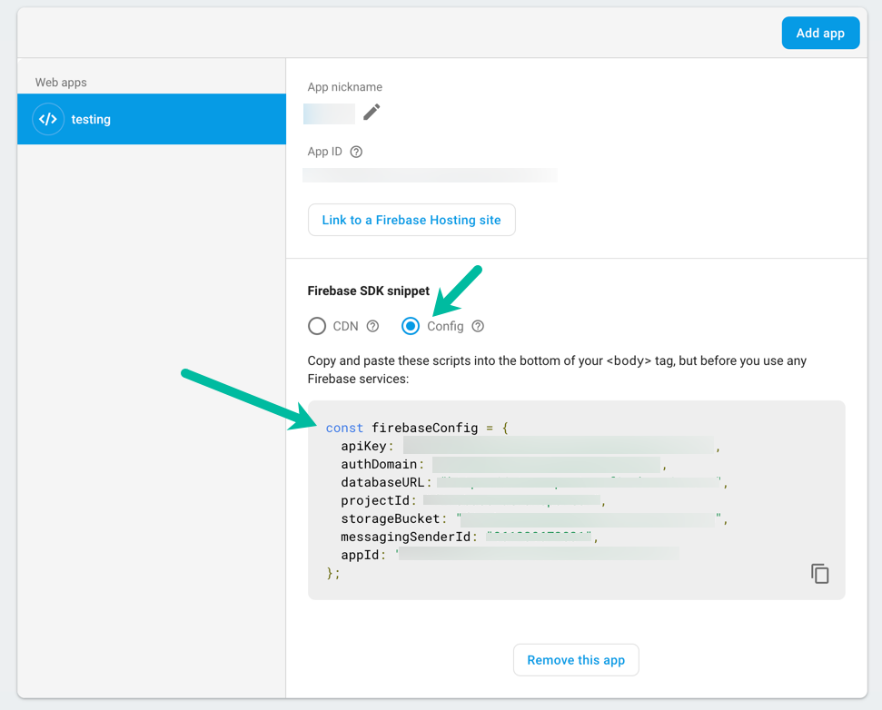

# Configuration

What you get out of this plugin in in large part related to how you configure it. The idea behind this configuration is to take full advantage of **Firemodel**'s watchers and in turn **Firebase**'s "real time" database characteristics. Hopefully this idea is not foreign to you but in a nutshell what we mean is that we should configure this plug so that we can "subscribe" to a series of "event streams" that represent change in the database that we care about.

## Example Config

Let's take the theory down a notch and look at an example configuration:

```typescript
const config = {
  // config for Firebase DB
  db: {
    apiKey: "...",
    authDomain: "...",
    databaseURL: "...",
    projectId: "..."
  },
  // connect db when initialized (true is the default)
  connect: true,
  // Auth Features
  useAuth: true,
  anonymousAuth: true,
  // Lifecycle hooks
  lifecycle: {
    onConnect,
    onLogin,
    onLogout,
    onRouteChange
  }
};
```

This configuration would then be added to your initialization of this plugin like so:

`src/store/index.ts` (or comparable)

```typescript
const store = new Vuex.Store<IRootState>({
  // ...
  plugins: [
    FirePlugin(config)
  ]
}
```

To understand what this is doing let's take it section by section.

## Connect

### Firebase Config

We **must** provide this plugin with the appropriate Firebase config to allow it to connect to the database. This is nothing more than the data that Firebase provides to you as part of the "app settings". How you get there has changed a bit recently (and may change again) but the first step is to choose "project settings" (see below): 


And from there you _now_ need to configure an "app" which can be a mobile or web based app. That is a 10 second process and then you'll be presented with a screen like you see below.



> Note: when landing on this page the radio button will have a lot of code which you don't need so just choose "config" and it will isolate it to just the configuration you'll need.

### When to Connect

By default this plugin will connect with the database immediately. That is probably the correct behavior 99% of the time but on the chance you _don't_ want it to connect right away you can set the `connect` property to false. If you do this then you would take on responsibility to **dispatch** the `@firemodel/connect` action at the point where you _do_ want to connect.

## Auth

### Watch Auth

Authentication and Authorization are critical features of almost every app and Firebase provides a great set of services to make this sometimes tricky process easy. There are, of course, other solutions out there so this plugin does _not_ assume you are using Firebase's Auth/Auth services but opting in is very easy:

```typescript
useAuth: true
```

This flag, when set to true, will setup a callback with Firebase which allows the plugin to be informed of any _auth_ related events. In turn it will do two things:

1. Keep the `@firebase/currentUser` up to date
2. Call the `onLoggedIn` / `onLoggedOut` lifecycle events as appropriate.

By default, this service is turned off.

### Anonymous Authentication

In addition to just stating that you'd like to use Firebase's authentication/authorization system, you can also opt-in to `anonymousAuth`. When this feature is turned on this plugin will -- immediately after connecting to the DB -- check for the appropriate tokens of a logged in user and _re_-login the user. If, however, there is no user tokens the existing session is logged in as an *anonymous* user.

This means that everyone interacting with the site _will_ be a tracked user of some sort. Some will be "known users" and others will be "anonymous users" but all will have a unique ID that tracks the identity of the user.

## Lifecycle Hooks

### Overview

This plugin provides the following lifecycle events which you can plug into to
add/remove/update the paths in the database which you are interested in (aka, which paths
you are "watching"):

- `onConnect(initial: boolean) => void` - as soon as the database is connected; this is
  the initial connection but also applies to subsequent connections if the database had
  gone down sometime after the initial connection.
- `onDisconnect() => void` - if the database disconnects at any point after the initial
  connection.
- `onLogin(uid: string, isAnonymous: boolean, ...) => void` - as soon as a user is logged
  in then this event is fired
- `onLogout(uid: string, isAnonymous: boolean, ...) => void` - as soon as a user is logged
  out this event is fired, allowing you to cleanup/change watchers

> **Note 1:** all lifecycle hook functions are `async` functions

> **Note 2:** the `onConnect()` and `onDisconnect()` events are listened to by this plugin
> and they in turn ensure that the `@firemodel` state tree always has a up-to-date view on
> this for your application.

### Examples of Usage

Let's now take a look at a few examples of what you might do with these hooks:

#### Listen to `UserProfile` on Login

Imagine that when you login using Firebase's identity system, you want to then start
watching the database on the given logged in user's "user profile":

```typescript
export async onLogin({ uid }) {
  await Watch.record(UserProfile, uid, { name: 'user-profile' });
}
```

#### Get all `Products` once connected

Imagine we have a store application and as soon as possible we want to pull down a list of
products (and inventory levels) from the store and then be kept up-to-date if anything
changes.

```typescript
export async onConnect() {
  await Watch.list(Product).all();
}
```

#### On logging out, Stop watching `UserProfile`

Once we've logged out we should have no interest in watching the user profile of the user
who _had_ been logged in (we also probably have no rights to anymore). In order to remove
our interest in the old user's `UserProfile` we could:

```typescript
export async onLogout() {
  await Watch.stop(Watch.findByName('user-profile'));
}
```
